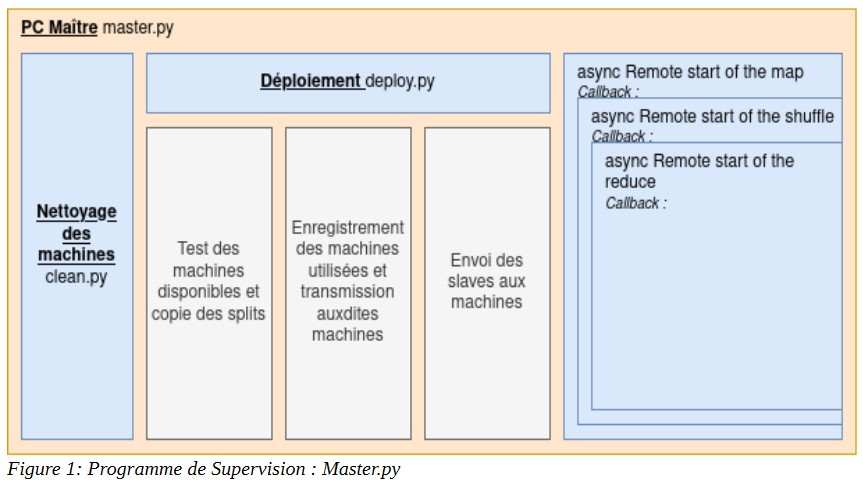
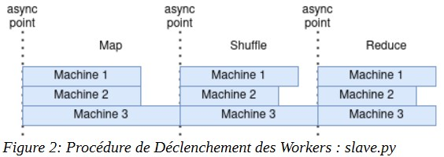

# PyMapReduce

## Introduction  
  For starters, MapReduce is a way to do muti-processing on different machines on an organization. Commonly used in datacenters for Big Data applications, its principles can be applied on every consumer tier computers.  
The objective of this project was to code a basic python implementation of the Map Reduce protocol for its use in a wordcount.

  
The processus seen from the Master Computer looks like Figure 1.  

When a processus is sent to process to distant machines,  their execution looks like the figure below

From an architecture standpoint, the computers and their interactions are as follow:

